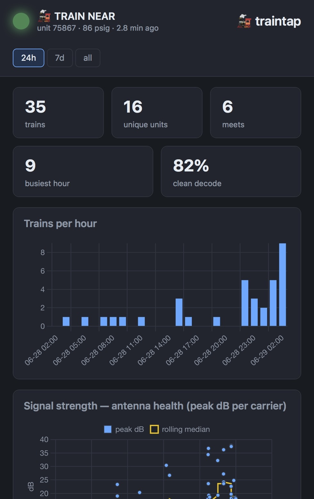

# traintap

Capture and decode **End-of-Train (EOT)** and **Head-of-Train (HOT)** telemetry
from passing freight trains with an RTL-SDR — a single self-contained Python CLI.

EOT devices (the "FRED" on the last car) transmit status — unit address, brake
line pressure, motion, marker light, battery — to the locomotive on the AAR
S-9152 wireless link. traintap tunes the radio, demodulates the signal natively
from I/Q, validates every packet against its built-in BCH check code, and logs
the decoded telemetry to your console and a CSV.

A companion **web dashboard** (FastAPI + Chart.js) shows live status — a
red/green "train near" light, trains/hour, signal strength for antenna tuning,
source (EOT/HOT/DPU) and decode-quality breakdowns, and a recent-trains table.

[](docs/dashboard-full.jpeg)

*(Click the image for the full-length dashboard.)*

## Quick start — do I have EOT signals near me?

You need: an **RTL-SDR**, a **UHF antenna** (a 70 cm ham whip is plenty — see
[Antenna & frequencies](#antenna--frequencies)), and **Docker**. Plug the SDR in,
then:

```sh
git clone https://github.com/trickv/traintap
cd traintap
docker compose up
```

That builds and starts the decoder (scanning EOT, decoding DPU too) **and** the
dashboard at **http://localhost:8000**. When a freight train passes, decoded
packets appear in the logs and on the dashboard within seconds.

Just want a quick console check, no dashboard?

```sh
docker run --rm --device=/dev/bus/usb ghcr.io/trickv/traintap --mode eot
```

No SDR handy but want to see it run? This decodes a synthetic packet end-to-end,
no hardware:

```sh
docker run --rm ghcr.io/trickv/traintap --selftest
```

Dongle not found? Make sure it's plugged in; if the `devices:` mapping doesn't
work on your system, set `privileged: true` on the `traintap` service in
`docker-compose.yml`. (The DVB TV driver is auto-detached at runtime, so you
normally don't need to blacklist anything.) Only one program can use the SDR at
a time.

## Antenna & frequencies

EOT/HOT/DPU are North American AAR S-9152 signals in the UHF **70 cm** band:

| Link | Frequency | Notes |
|---|---|---|
| **EOT** (rear → loco) | **457.9375 MHz** | frequent telemetry — the main signal |
| **HOT** (loco → rear) | **452.9375 MHz** | infrequent commands |
| **DPU** (distributed power) | **457.9250 MHz** | mid-train locos; decoded alongside EOT |

A **70 cm / UHF antenna is good enough** — a 70 cm ham whip, a UHF scanner
antenna, or the RTL-SDR dipole kit with each element set to **~16 cm** (a quarter
wave at 458 MHz). Mount it **vertically** (these signals are vertically
polarized), with as clear a path toward the tracks as you can manage. UHF falls
off fast indoors and especially in basements, so a window or outdoor placement
helps a lot. You don't need to be trackside — within a few hundred meters of a
passing train is plenty.

## How it works

```
RTL-SDR I/Q ─► NCO mix (offset tune) ─► decimate to 48 kHz + channel filter
            ─► FM demod ─► 1200/1800 Hz AFSK matched filters ─► DPLL @ 1200 baud
            ─► sync-word search ─► 45-bit data block + 18-bit BCH check ─► fields
```

No `rtl_fm`, `sox`, or patched `minimodem` — the whole chain is numpy/scipy in
one process. Only BCH-valid packets are reported, so output is trustworthy.

### Signal facts (North America)

| | Frequency | Direction | Traffic |
|---|---|---|---|
| **EOT** | 457.9375 MHz | rear → loco | frequent telemetry (the main prize) |
| **HOT** | 452.9375 MHz | loco → rear | infrequent commands (arm, comm-test, emergency) |
| **DPU** | 457.9250 MHz | distributed power | mid-train loco telemetry (decoded alongside EOT) |

Because DPU is only 12.5 kHz from EOT, it falls inside the same capture — traintap
demodulates it from the same I/Q at a second offset (no retuning), so you get DPU
for free whenever listening for EOT. (Disable with `--no-dpu`.) DPU shares EOT's
AAR framing/BCH; its non-address field semantics are provisional pending a clean
live capture.

### Train passes (EOT ↔ DPU correlation)

Packets heard within `--pass-gap` seconds of each other are the same train going
by. `--passes-csv` logs one row per pass — start/end, and the EOT unit ID(s)
alongside any DPU (and HOT) units heard together — so a mid-train distributed-
power unit is tied to the EOT that identifies the train. The console prints a
`== PASS hh:mm:ss-hh:mm:ss  EOT 69686x4  DPU 12345x2` line as each pass closes.

Modulation is 1200-baud FFSK in an ~8 kHz NFM channel (mark 1200 Hz, space
1800 Hz after FM demod).

### Why scanning (and its limits)

EOT and HOT are **5.0 MHz apart**, which exceeds a single RTL-SDR's usable
bandwidth (~2.4 MHz) — so **one dongle cannot watch both at once** (true with any
software, including KA9Q-radio). traintap **time-shares**: it dwells mostly on
EOT and dips to HOT periodically. It favors EOT while a train is active and
lingers on HOT briefly when a HOT packet decodes. Catching *all* HOT requires a
second receiver (a 2nd RTL-SDR on 452.9375, or a wide SDR + KA9Q-radio).

`--mode hotwatch` is an alternative strategy that treats HOT as an *approach
warning*: idle, it spends most of its time (`--hot-fraction`, default 70%)
listening for HOT (the head end), and the moment a HOT packet decodes — meaning a
train's front is arriving — it locks onto EOT/DPU 100% for `--focus-minutes`
(default 10) to catch the body and the rear (FRED) as the train finishes passing.
Best for lines with two-way/armed trains that actually transmit HOT.

## Install from source (without Docker)

Prefer Docker (above) for the least fuss. To run it natively instead:

System dependency (the native RTL-SDR library — not pip):

```sh
sudo apt install rtl-sdr librtlsdr-dev
# free the dongle from the DVB kernel driver:
echo 'blacklist dvb_usb_rtl28xxu' | sudo tee /etc/modprobe.d/blacklist-rtl.conf
# then replug the dongle (or: sudo modprobe -r dvb_usb_rtl28xxu)
```

### udev rules (use the dongle without `sudo`)

The `rtl-sdr` package usually installs these at `/etc/udev/rules.d/rtl-sdr.rules`.
If missing (or you built from source), add them:

```sh
sudo tee /etc/udev/rules.d/20-rtlsdr.rules >/dev/null <<'EOF'
# RTL-SDR (Realtek RTL2832U) — grant access to the plugdev group
SUBSYSTEM=="usb", ATTRS{idVendor}=="0bda", ATTRS{idProduct}=="2832", GROUP="plugdev", MODE="0666", SYMLINK+="rtl_sdr"
SUBSYSTEM=="usb", ATTRS{idVendor}=="0bda", ATTRS{idProduct}=="2838", GROUP="plugdev", MODE="0666", SYMLINK+="rtl_sdr"
EOF
sudo udevadm control --reload-rules && sudo udevadm trigger
# then unplug and replug the dongle
```

Find your dongle's `idVendor:idProduct` with `lsusb` (look for "Realtek") if it
differs. Confirm membership in `plugdev` (`groups | grep plugdev`; add with
`sudo usermod -aG plugdev $USER` then re-login). After replugging, `rtl_test -t`
should run as a normal user with no "usb_claim_interface error -6".

Python package:

```sh
python3 -m venv .venv && . .venv/bin/activate
pip install -e .            # installs numpy, scipy, pyrtlsdr + the `traintap` command
```

Verify the radio: `rtl_test -t`, then `traintap --list-devices`.

## Usage

```sh
# Scan EOT+HOT, log to CSV, suppress repeat console lines within 30 s per unit:
traintap --mode scan --csv trains.csv

# EOT only (simplest, never misses the frequent telemetry):
traintap --mode eot

# Tuning aids:
traintap --gain 40 --ppm 12         # fixed gain (dB) and freq correction

# No hardware needed — prove the DSP+decoder work:
traintap --selftest
```

Console output (one line per packet, deduped):

```
14:02:11 EOT 457.9375  unit 45678    92 psig  batt OK/94%  [MOVING light]
```

### Capture & replay (for testing / tuning without a live train)

```sh
traintap --record pass.npz --record-seconds 20   # save 20 s of I/Q on EOT
traintap --replay pass.npz --csv pass.csv        # decode it offline
```

Record real I/Q while a train passes, then replay it as a regression fixture.

## Key options

| Flag | Meaning |
|---|---|
| `--mode {scan,eot,hot,hotwatch}` | channel strategy (default `scan`) |
| `--hot-fraction` | hotwatch: idle share of time on HOT (default 0.7) |
| `--focus-minutes` | hotwatch: lock onto EOT/DPU for N min after a HOT hit (default 10) |
| `--eot-dwell` / `--hot-dwell` | seconds per dwell while scanning |
| `--gain` | `auto` or gain in dB |
| `--ppm` | crystal frequency correction |
| `--offset` | tuning offset below channel to dodge the DC spike (default 250 kHz) |
| `--csv FILE` | append decoded packets (CSV, header on create) |
| `--bch-correct N` | BCH-correct up to N bit errors/frame (`0` = off; default 2) |
| `--passes-csv FILE` | log one row per train pass (EOT ID ↔ DPU/HOT units) |
| `--pass-gap S` | silence (s) that ends a train pass (default 90) |
| `--dedupe S` | suppress repeat console lines per unit for S seconds (`0` = off) |
| `--stats-interval S` | live summary cadence (`0` = off) |
| `--keep-invalid` | also show BCH-failed packets (debugging) |

## Status & roadmap

- **EOT** decoding is complete and BCH-validated, with syndrome-based error
  correction (up to 3 bit errors; `--bch-correct`, default 2). Corrected packets
  are flagged with their correction count in the console (`~Nb`) and CSV. To keep
  correction from accepting noise, a *corrected* packet is only emitted once
  **corroborated** — the same unit also seen clean, or repeated within a pass;
  isolated corrected frames are dropped. Uncorrected (exact-BCH) packets are
  trusted immediately.
- **HOT** shares the front end and BCH check; its command-message field semantics
  are provisional pending real captures (`--record` to help characterize).
- **DPU** (457.9250) is decoded from the same EOT capture; field semantics beyond
  the unit address are provisional pending a clean live DPU capture to confirm.
- Future: simultaneous EOT+HOT via a second receiver.

## Attributions

traintap stands on the shoulders of prior EOT/HOT reverse-engineering and
decoding work:

- **[PyEOT](https://github.com/ereuter/PyEOT)** (Eric Reuter, 2018, GPL) — the
  original Python EOT decoder. traintap's BCH check algorithm and EOT data-block
  field layout (`traintap/frame.py`) are ported from it; this is the reason
  traintap is GPL-licensed.
- **[EOTDecode](https://github.com/russinnes/EOTDecode)** (Russ Innes, 2023) —
  a PyEOT-derived decoder; the specific `helpers.py`/`eot_decoder.py` constants
  and offsets traintap reuses were cross-checked against this fork.
- **[SoftEOT](https://groups.io/g/SoftEOT)** — a Windows EOT/HOT decoder; the
  community reference implementation for these signals.
- **[SDRangel](https://github.com/f4exb/sdrangel)** — includes an EOT demod/decoder.
- **[Signal Identification Wiki — EOTD](https://www.sigidwiki.com/wiki/End_of_Train_Device_(EOTD))**
  and **[rtl-sdr.com](https://www.rtl-sdr.com/tag/end-of-train/)** — frequency,
  modulation, and protocol references.

What traintap adds over the above: an in-process native-I/Q front end (replacing
the `rtl_fm | sox | minimodem` chain), BCH error correction, time-share EOT/HOT
scanning with DPU decoded from the same capture, EOT↔DPU train-pass correlation,
and a live web dashboard. Receive-only by design.

Bundled third-party code: [Chart.js](https://www.chartjs.org/) (MIT) in
`dashboard/static/vendor/`.

## License

GPL-3.0-or-later — see [LICENSE](LICENSE). traintap is a derivative of the
GPL-licensed PyEOT, so the project carries the GPL forward. The bundled Chart.js
(MIT) and the BSD/MIT-licensed dependencies (numpy, scipy, uvicorn, FastAPI) are
GPL-compatible.
